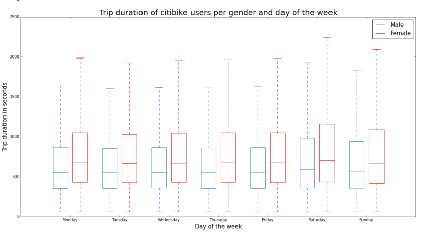

HW8 README
======

# PEER REVIEW

#### Plot 1 : Average income by gender

[link](https://github.com/Tengf/PUI2015_tzheng/blob/master/HW8/hw8.png
)
Plot present us to the correlation between average income by race: for males on X-axis, and for female on Y-axis.
It also consist of 1:1 ratio line, as well as two lines representing different liner regression. Plot seems to be
clear and precise, with title, both axes labelled and a legend.

Of course, it is hard to judge any work from aesthetical perspective, yet I will try to share some general thoughts on plot improvement as bullets below:
- [ ] First, it would be great to have more space between the title and plot itself.
- [ ] don't use "~" in title.
- [ ] Don't Use Capital Letters For Each Word In Title And Labels (it sounds more grammar nazi, yet it definetely improves visual part of the plot as well)
- [ ] It might not be the case, but personally I'd make both axis to use thousands USD as units: this will make ticks smaller and easier to read, and will remove empty space between left label and the plot
- [ ] change lagend to draw only one point per label
- [ ] change line styles in general or in their legend representations, as for some reason legend and "real" line have different dash sizes, and it is quite hard to match them
- [ ] remove either **regression** or **regression through 0** (probably the second one) as this doubling add more confusion than information
- [ ] change legend language - words like "my regression" sounds strange, and make confusion: "regression through 0" is not yours? Also, "all" sounds confusing
- [ ] change regression representation, as I barely can find it on plot: my bet is to make it continuous bright line and add transparency both to it and **analitical regression**
- [ ] plot colored dots above the line
- [ ] colors for both "my" regressions are sad, hard to see and obviously not good for colorblindness reason.
- [ ] 1:1 Axis is not presented in the legend. It is also one of the 2 most bright and visually stressed elements on the plot, which obviously do not follow our intentions - it should be minor helper-element. I would offer continuous transparent pink or red line instead.
- [ ] Of course, largest visual problem of the plot is a huge visual noise, created by black dashed axis and grey minor points (they are not presented in legend as well, by the way). apart of changing axis style (discussed that above), we can make grey dots lighter, and remove their white border. Also, it might be helpful to add some transparency - this will give us some clues on exact dot density in dense areas.
- [ ] Another large problem is that visual priority of elements does not correspond with their real importance: for example, the most stressed element is "analytical regression" line, which is practically have equal priority to other regressions - either they all should be dashed, or all continuous (I prefer last option).
- [ ] then, **real  number one priority elements** are those large points: then they need to be the most visually stressed one - bright color would be good, but at least they should be on the top layer of visualisation.
- [ ] last one: some sort of grid would help really.

One option to consider is to remove colored points from the legend and adding their labels right on the spot - they all unique apart of "asian", and those both places nearby. I believe this will add both to visual clarity and readability of the plot.

Despite some visual flaws, plot appears to be technically correct and honest.

#### Plot 2 : Trip duration of citibike users per gender and day of the week

[link](https://github.com/diogomiura/PUI2015_dmiura/blob/master/HW8/dmiura_HW8.ipynb)

Plot articulates the difference between duration of trips for men and  women cycling in New York for different weekdays. Plot appears to be clean and accurate, with no major visual problems.
  Yet, here are some points to consider:

  - [ ] colors are awesome, yet could make plot not readable for colorblind person or as a b/w print version.
  - [ ] for Y-axis label, I would change "in seconds" to ", sec."
  - [ ] It would be great to make title larger, in order to distinguish it from axis labels and legend
  - [ ] In this specific case, plot is very clean and easy - we can reduce the size twice without loosing any visibility. I'd consider reducing plot width to fit better plot proportions
  - [ ] In this specific case we also don't need frame that much - both for plot and legend. It would be great to keep only Y axis line.
  - [ ] This is totally optional. but I'd like to add some visual border between workdays and weekend days - either line or fill weekend zone with the light-gray (?) background.
  - [ ] There is no need to add more information if this plot is just an illustration to the article. Yet, if I will see this as an independent slide, I'd like to know date range for presented trips.

  Anyway, plot appears to be clean, readable and honest.

#### plot3: Total Building energy use in 2013 vs number of units in Building, Manhattan.

[link](https://github.com/diggity2036/PUI2015_dcrull/tree/master/HW8)

Plot itself is very beautiful and easy to read one - there are only few minor points to consider for improvement:

- [ ] Title should be large, labels should be small.
- [ ] I think, we can simplify the title, removing unnecessary details. You can add them into the plot itself, or write in the comments to the plot (or in very small font just below the plot - especially info on the dataset)
- [ ] please, use only one dot per label in the legend
- [ ] you don't need to feel yourself restricted to two digits in ticks labeling: no need for things like **05**.
- [ ] It might be good to slightly change color of Commercial and office buildings just slightly - now it is a bit hard to see them over the plot grid.

Anyway, plot is quite beautiful and honest in the representation, and a good one to narrate a story: we can clearly see here two models - linear correlation for multi-family and mixed use buildings, and a lot of noise for commercial and industrial ones.

# Horisont chart (explanation)

Horisont plot - special type of plot, developed for multiple time series visualisation, quite popular in finances.
It is quite simple when you understand it: in order to prevent low values from falling into one line, we "fold" the plot N times (N is selected manually, in my case N=3), in other words we chop everything above max_value/N and put it down, and so on so forth N-1 times.

This way we visually "normalize" data, so it starts to be much more readable on the fly.  Unfortunately, I failed to find good
python implementation, so I decided to try make one.

##More on horisont charts
- [cubism](https://square.github.io/cubism/)
- [article](http://www.perceptualedge.com/articles/visual_business_intelligence/time_on_the_horizon.pdf)
